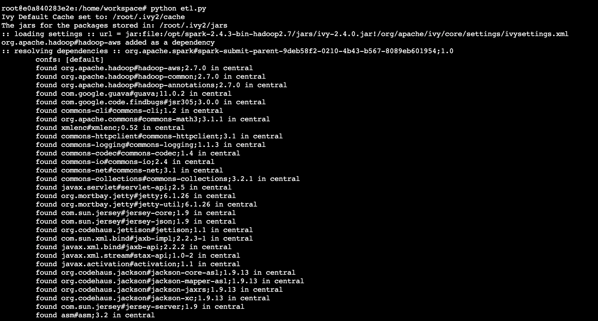
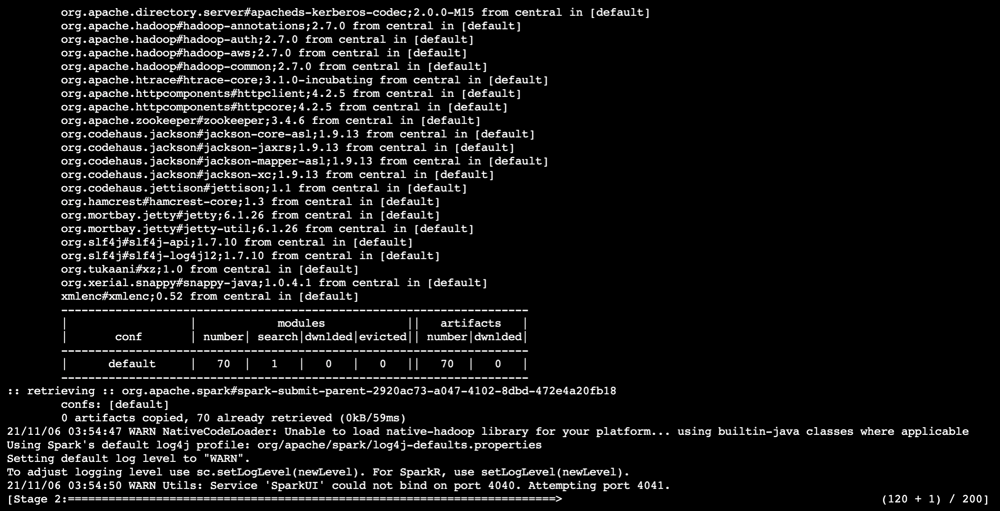
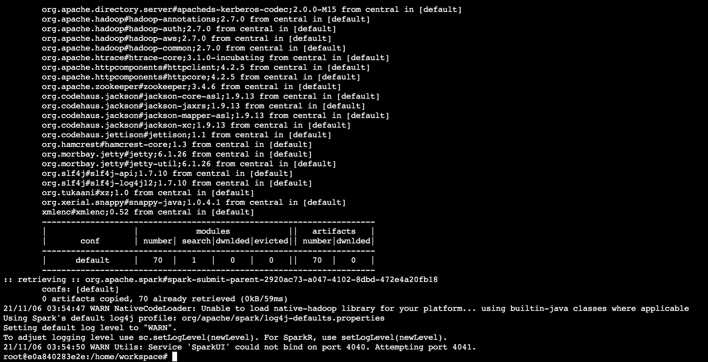

<h2>Project Overview</h2>

This project is implemented for Sparkify which is a music streaming platform, to be able to perform analytical processes on their ever-growing data while making the best use of existing and popular big data technologies. As a music steaming app, the need for fast data manipulation and transformation is critical since thousands or more users are using the app every day. To be able to access analytical data efficiently is very important because such data maybe used for purposes like marketing.
With this project, the raw and uncleaned streaming data will be able to be transformed into desired data types and formats and then be saved into various tables for further use.
The script included in this project will load the data from Amazon S3 into the Spark Engine, do various steps of data manipulation and transformation and then save the cleaned and structured data back into Amazon S3 storage.
  

People at Sparkify might now be relying on traditional SQL functions to do analysis on data. As a music streaming app, there will be thousands, if not, more records being saved to the database every hour and within a few years time, there will be many records to perform analysis upon. Here, using traditional SQL tools would not be very efficient. That is why Spark is chosen here. With Spark, no matter how big the data size is, there will be less processing time cause it is processed parallel across multiple clusters.
We are using the pyspark library which is an interface for Spark in python and typical database tasks like SELECT can be executed with a few lines of code. It can even execute SQL commands so, even if the user is a python programmer or a data analysts who only knows SQL, it can be easy to understand for both.

<h2>Files Included</h2>

<ol>
     <li><code>etl.py</code> - All ETL pipeline operations are written here.</li>
      <li><code>dl.cfg</code> - The credentials for accessing the AWS service are written here.</li>

</ol>

<h2>ETL Process</h2>

The whole ETL process is written inside <code>etl.py</code> script. It will first load the data from Amazon S3 into Spark's dataframes. There are two types of data to be loaded: songs and logs. Song data is loaded and processed first and then log data is processed. The neccessary data cleaning is done for both with operations such as removing duplicates, casting columns to their appropriate data types, add/remove columns, etc. If valid AWS credentials are provided, the whole process will run in a matter of minutes without any setbacks.
    
<h2>How To Run</h2>

- Open the terminal.
- Navigate to the project folder by entering <code><b>cd</b> path-to-the-project</code> in the terminal.
- Type <code><b>python</b> etl.py</code> in the terminal to execute the ETL script. The needed libraries will be loaded first automatically as shown below.

- A lot of processes will be done and it can take a few minutes or more depending on the internet connection and the region of S3
  buckets or your AWS account or the difference between them i.e, they are in different regions. 
- The most common error at this point is related to the AWS credentials so make sure if you have used the correct ones.
- Spark will take numerous stages to processes your data.
    

- If no error occurs, the cursor will be reappeared as shown below and it can be said that the ETL process is finished.
 
   
<h2>Technologies Used</h2>

<ul>
<li>
 
[configparser](https://docs.python.org/3/library/configparser.html) - Configuration file parser

</li>
    
<li>
    
[PySpark](http://spark.apache.org/docs/latest/api/python/) - Apache Spark Interface for Python
    
</li>
    
<li>
    
[Amazon S3](https://aws.amazon.com/s3/) - Cloud Object Storage
    
</li>
</ul>